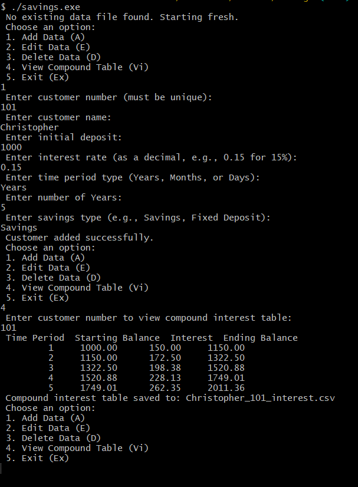

# FORTRAN

## Learning Fortran

This are learning modules, tailored from learning the Fortran Language:

-   [QT](./QT): Stems from the [Fortran QuickStart Tutorial](https://fortran-lang.org/learn/quickstart)
-   [Modern Fortran](./modern_fortran): Stems from learning using the Modern Fortran Building Efficient Parallel Applications by Milan Curcic

## PROJECTS

### [Savings](./savings)

Calculation of compound interest table for various customers

# Remarks

So far so good
