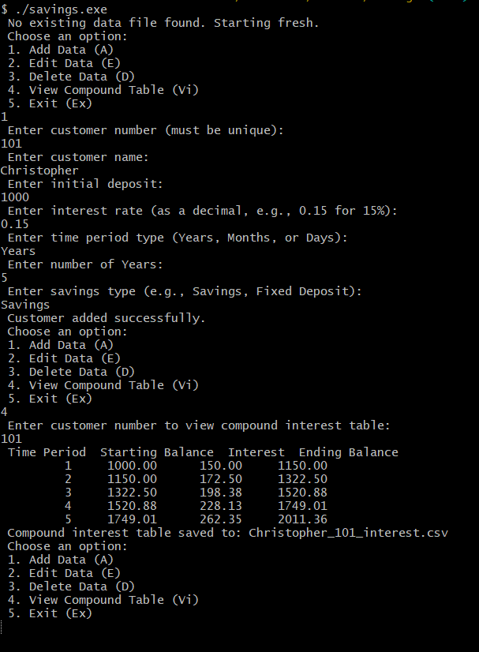

# FORTRAN Project: Savings, Cummulative Interest and Amount Calculator

At start of program, with a fresh start, prints `No existing data file found. Starting fresh` as no savings file exists, otherwise skips printing. It prompts user to select an option:

Choose an option:

1.  Add Data (A)
2.  Edit Data (E)
3.  Delete Data (D)
4.  View Compound Table (Vi)
5.  Exit (Ex)

If selected (A) Add Data, the program prompts user for:

-   number
-   name
-   initial deposit
-   time period (Years, Months, Days)
-   Type of Savings (Fixed or Savings)

Customer added successfully after.

If selected (A) Add data, but customer exists, raises the "Customer Number Exists"

TODO: Exception handling incase of invalid type input eg character in real number eg deposit

If selected Edit, adjust the data accordingly. If user does not exist, raise warning.

If selected (3) Delete, confirm deletion thereafter In case of view, show all compound interest table of customer and prints to csv, names after customer

Selection of (5) Exit, exits the program.

